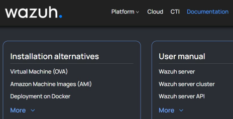
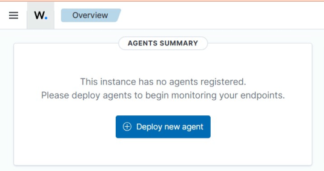
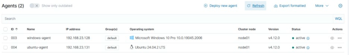

# Wazuh SIEM Deployment & Agent Enrollment

## Overview

This lab documents my initial Wazuh deployment in a VMware environment. I imported the Wazuh virtual appliance, accessed the dashboard, enrolled Windows and Linux endpoints, and verified that the agents were connected.

## Lab Flow

```text
Deploy Wazuh OVA
      |
      v
Identify Wazuh Server IP
      |
      v
Access Dashboard
      |
      +--> Enroll Windows Agent
      |
      +--> Enroll Linux Agent
      |
      v
Verify Active Agents
```

## Key Commands Used

Check the Wazuh server IP:

```bash
ip a
```

Check Linux architecture before choosing the agent package:

```bash
uname -m
```

After deploying an agent, the service status can be checked from the endpoint before confirming it in the Wazuh dashboard.

## What I Implemented

- Imported and powered on the Wazuh OVA in VMware.
- Identified the Wazuh server IP and accessed the web dashboard.
- Deployed a Wazuh agent to a Windows endpoint.
- Deployed a Wazuh agent to a Linux endpoint.
- Verified that the enrolled endpoints appeared as active agents.

## Selected Evidence







Full screenshot sequence: [screenshots/](./screenshots/)

## What I Learned

This lab established the basic SIEM environment I later used for file-integrity monitoring, Suricata integration, log analysis, and detection engineering.

The important part was understanding the relationship between the **Wazuh manager**, **endpoint agents**, and the **dashboard** rather than only installing the appliance.

## Evidence & Documentation

- [Implementation notes](./docs/implementation.md)
- [Validation notes](./docs/validation.md)
- [Screenshot evidence](./screenshots/README.md)
- [Original lab notes](./docs/original-lab-notes.pdf)

## Security Note

The original lab notes contain default appliance credentials used in the training environment. Default credentials should be changed immediately in any real deployment.

## Status

**Completed** - Wazuh was deployed and both endpoint agents were verified as active in the lab.
