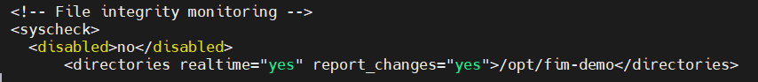
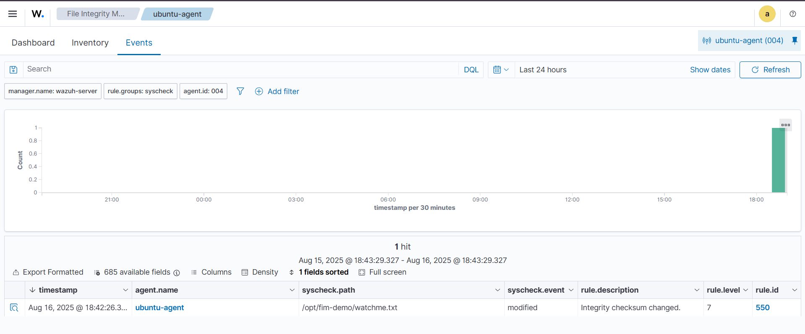
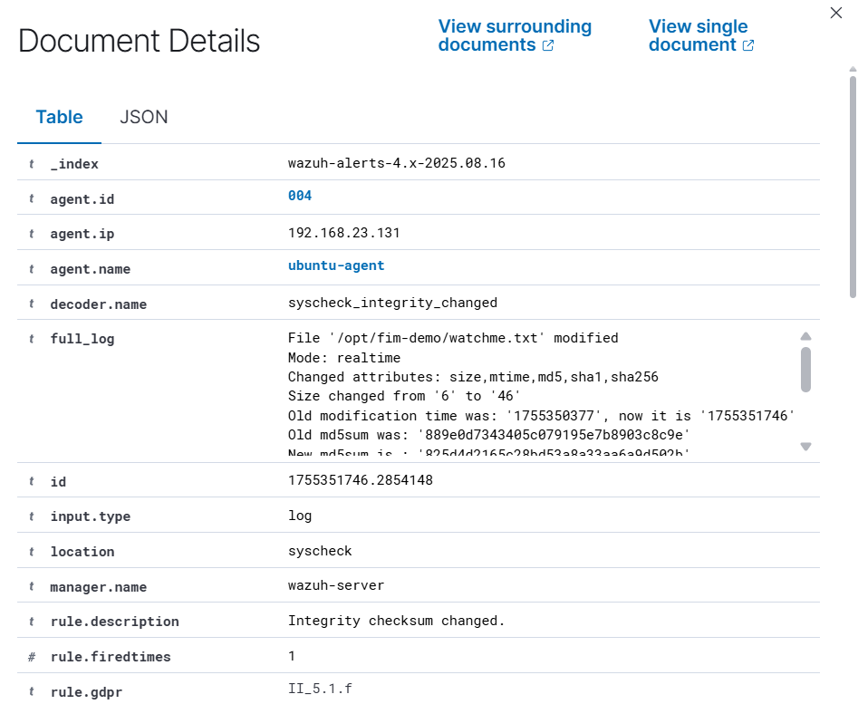
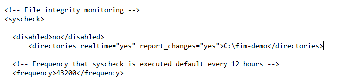
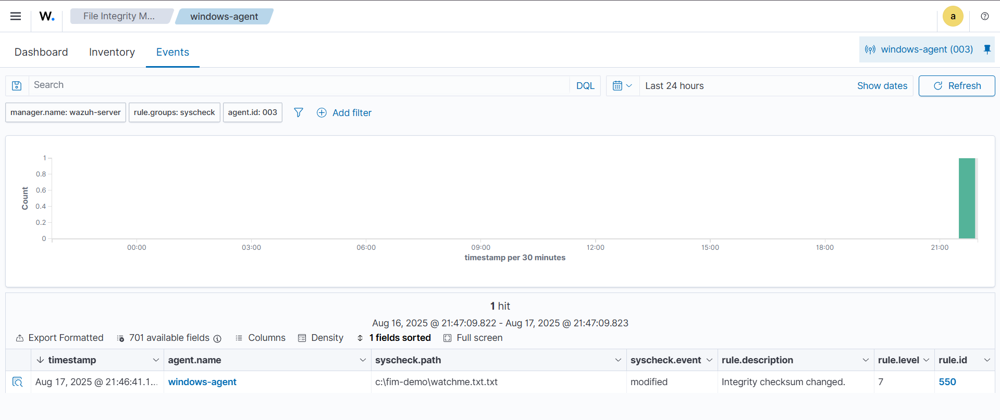
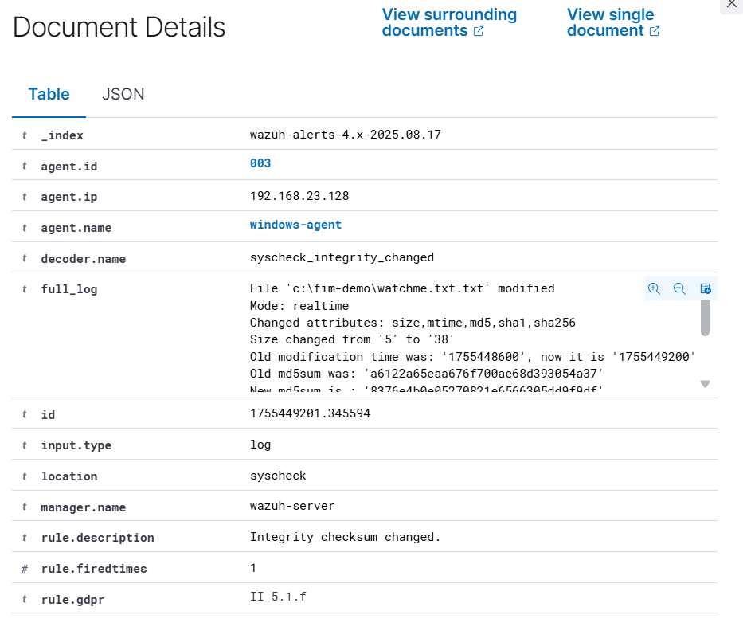

# Wazuh File Integrity Monitoring

## Overview

This lab tested Wazuh File Integrity Monitoring (FIM) on both Ubuntu and Windows endpoints.

The goal was to define test directories, create or modify files inside them, and verify that Wazuh recorded the resulting file-integrity events.

## Ubuntu Implementation

Create the test directory and file:

```bash
sudo mkdir -p /opt/fim-demo
echo "start" | sudo tee /opt/fim-demo/watchme.txt
```

Open the Wazuh agent configuration:

```bash
sudo nano /var/ossec/etc/ossec.conf
```

Add the monitored directory inside the `<syscheck>` block:

```xml
<directories realtime="yes" report_changes="yes">/opt/fim-demo</directories>
```




Restart the agent:

```bash
sudo systemctl restart wazuh-agent
```

Generate a file change:

```bash
echo "changed $(date)" | sudo tee -a /opt/fim-demo/watchme.txt
```

The resulting event was then reviewed under Wazuh File Integrity Monitoring.







## Windows Implementation

The Windows test path was:

```text
C:\fim-demo\watchme.txt
```

The Wazuh agent configuration included:

```xml
<directories realtime="yes" report_changes="yes">C:\fim-demo</directories>
```




Restart the Wazuh service from an elevated PowerShell session:

```powershell
Restart-Service -Name WazuhSvc
```

After modifying the test file, I verified the resulting event in the Wazuh dashboard.







## What I Validated

- monitored file path;
- file modification event;
- event timestamp;
- change details reported by Wazuh; and
- FIM operation on both Linux and Windows endpoints.

## Evidence & Documentation

- [All screenshots](./screenshots/README.md)

- [Configuration notes](./docs/configuration.md)
- [Validation notes](./docs/validation.md)
- [Original lab notes with screenshots](./docs/original-lab-notes.pdf)

## Status

**Completed** - file changes on both Windows and Ubuntu were detected in the lab.

