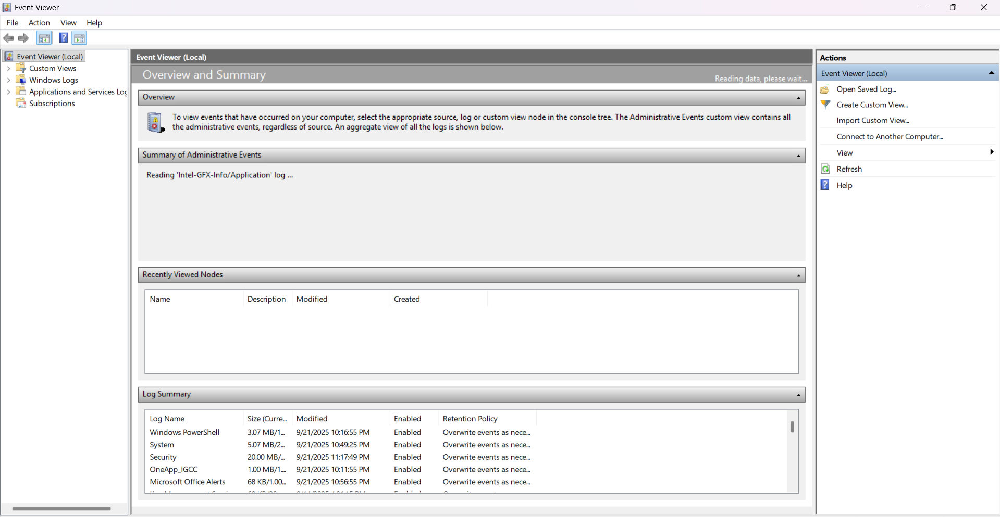
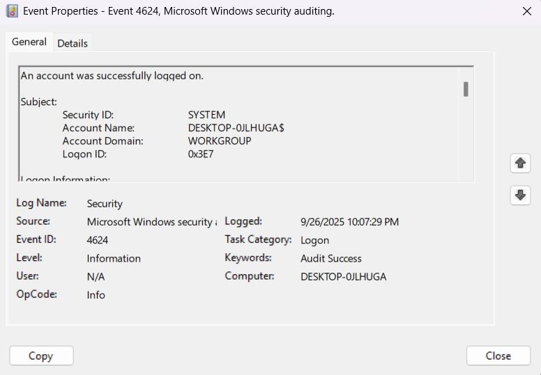
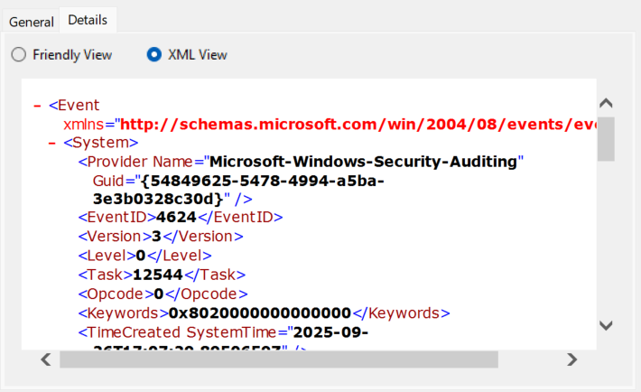
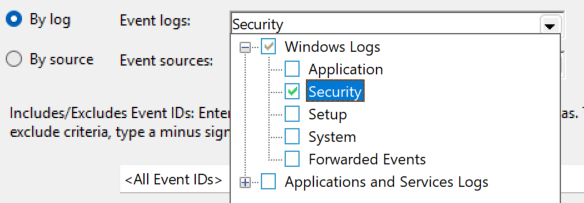
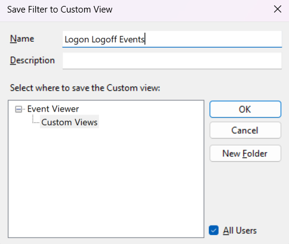

# Windows Log Analysis & Sysmon Lab

## Overview

This lab focused on understanding Windows event logs and the additional endpoint telemetry provided by Sysmon.

It is a foundational log-analysis lab rather than a complete detection-engineering project.

## Key Commands

Open Windows Event Viewer from Run or Command Prompt:

```text
eventvwr
```




Windows event files can be exported as:

```text
.evtx
```

## Windows Logs Reviewed

| Log | What I used it to understand |
|---|---|
| Application | Application-generated events |
| System | Windows services and OS-level events |
| Security | Logons, authentication failures, account/security activity |
| Setup | Installation/update events |
| Forwarded Events | Events collected from other systems |
| PowerShell | PowerShell-related telemetry |
| Sysmon | Detailed process, file, and network telemetry |

## Example Security Event

Windows Security Event ID:

```text
4624 - Successful logon
```




The XML view exposes the event fields for inspection.




## Custom Views

The lab also covered using Event IDs to create Custom Views so that specific event types can be filtered instead of reading the entire log stream.







## Sysmon

The notes introduce Sysmon as a source of additional endpoint telemetry. The included Sysmon image is an Event ID reference table; it does not demonstrate an installation or a captured Sysmon event.

The concepts reviewed included:

- process creation;
- command-line arguments;
- file activity;
- network connections; and
- using an XML configuration to control what Sysmon records.

This became useful later in my [SOC Detection Engineering project](https://github.com/Zayan9484/SOC-Detection-Engineering), where Sysmon process telemetry was ingested into Wazuh and used for encoded PowerShell detection.

## Evidence & Documentation

- [All screenshots](./screenshots/README.md)

- [Log-analysis notes](./docs/log-analysis-notes.md)
- [Original lab notes with screenshots](./docs/original-lab-notes.pdf)

## Status

**Completed as a foundational lab** - Windows logging concepts and Sysmon telemetry were studied and practiced in the lab environment.

