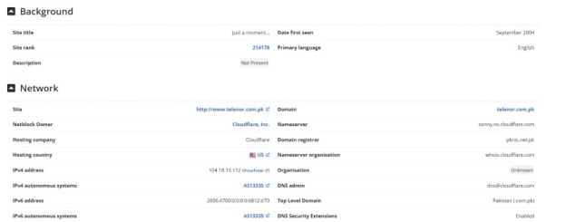
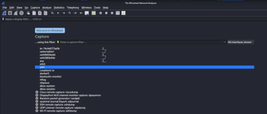
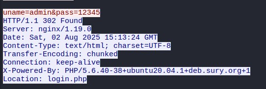

# OSINT & Packet Analysis Lab

## Overview

This lab combined two foundational security exercises:

1. collecting publicly available technical information about an organization; and
2. inspecting HTTP traffic from an intentionally vulnerable web application with Wireshark.

The work was limited to public information and controlled training traffic.

## Reconnaissance Commands Used

Check for a web application firewall:

```bash
wafw00f <target-domain>
```

Enumerate subdomains:

```bash
subfinder -d <target-domain>
```

Validate responding hosts:

```bash
cat sub-domains.txt | httprobe
```

Other tools used during the exercise included Netcraft, IP2Location, Wappalyzer, Assetfinder, crt.sh, httpx, Shodan, and Kali Linux utilities.

## Reconnaissance Workflow

```text
Primary Domain
     |
     +--> Hosting / IP / Registrar Research
     |
     +--> Technology & WAF Checks
     |
     +--> Subdomain Enumeration
     |
     +--> Reachability Validation
     |
     v
Cross-checked Public Attack Surface Information
```

## Selected Evidence





## Wireshark Packet Analysis

The packet-analysis portion used an intentionally vulnerable training web application.

The workflow was:

1. start the capture;
2. submit test credentials to the vulnerable HTTP login page;
3. filter for the HTTP POST request;
4. follow the HTTP stream; and
5. inspect the submitted request contents.

This demonstrated why credentials should never be transmitted over unencrypted HTTP.



Full screenshot sequence: [screenshots/](./screenshots/)

## Evidence & Documentation

- [OSINT methodology](./docs/osint-methodology.md)
- [Packet-analysis notes](./docs/packet-analysis.md)
- [Screenshot evidence](./screenshots/README.md)
- [Original lab notes](./docs/original-lab-notes.pdf)

## Status

**Completed as a training lab** - public-source reconnaissance and HTTP packet inspection were practiced and documented.
