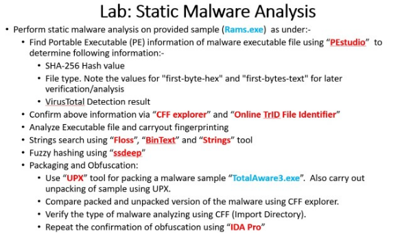
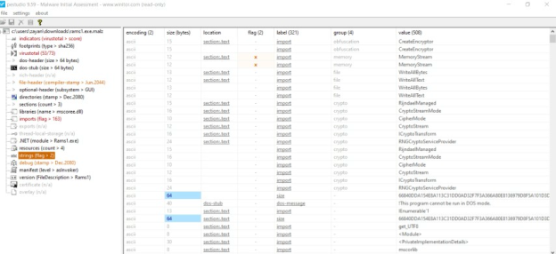
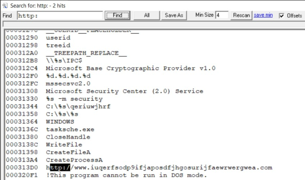
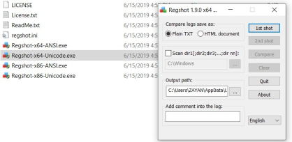

# Malware Analysis Lab

## Overview

This lab documents malware-analysis practice in an isolated virtual environment using FlareVM and supporting analysis tools.

The repository contains documentation and screenshots only. **No malware samples, payloads, or deployable malicious code are included.**

## Analysis Workflow

```text
Isolated Sample
     |
     +--> Static Analysis
     |      Metadata / Hashes / Strings / Packing
     |
     +--> Controlled Dynamic Analysis
            Process / Network / Registry Changes
     |
     v
Document Indicators and Observed Behaviour
```

## Key Commands Used

Allow the FlareVM installation script during the original lab setup:

```powershell
Set-ExecutionPolicy Unrestricted
.\install.ps1
```

Extract strings with FLOSS:

```text
FLOSS.exe <sample>
```

Example used in the lab to save output:

```text
FLOSS.exe C:\Users\ZAYAN\Desktop\WannaCry\Ransomware.wannacry > mydata.txt
more mydata.txt
```

Review UPX usage and unpack a packed training sample:

```text
upx.exe
upx.exe -d <sample.exe>
```

The lab also used GUI tools such as PEStudio, CFF Explorer, TCPView, FakeNet, and Regshot.

## Static Analysis

I practiced:

- file type/header inspection;
- hash collection;
- entropy/packing indicators;
- string extraction;
- comparing results across multiple tools; and
- recording suspicious URLs, paths, and other possible indicators.





## Dynamic Analysis

Dynamic observations were performed only in the isolated lab.

The workflow included:

- observing process/network activity;
- checking simulated network requests;
- taking registry snapshots before and after execution; and
- documenting behavior that could support later detection or investigation.





Full screenshot sequence: [screenshots/](./screenshots/)

## Evidence & Documentation

- [Analysis workflow](./docs/analysis-workflow.md)
- [Lab safety notes](./docs/safety.md)
- [Screenshot evidence](./screenshots/README.md)
- [Original lab notes](./docs/original-lab-notes.pdf)

## Safety

The portfolio intentionally excludes malware binaries, deployable payloads, persistence code, and evasion code. It documents defensive analysis techniques and observations only.

## Status

**Completed as a malware-analysis training lab** - static and dynamic analysis techniques were practiced in an isolated environment.
